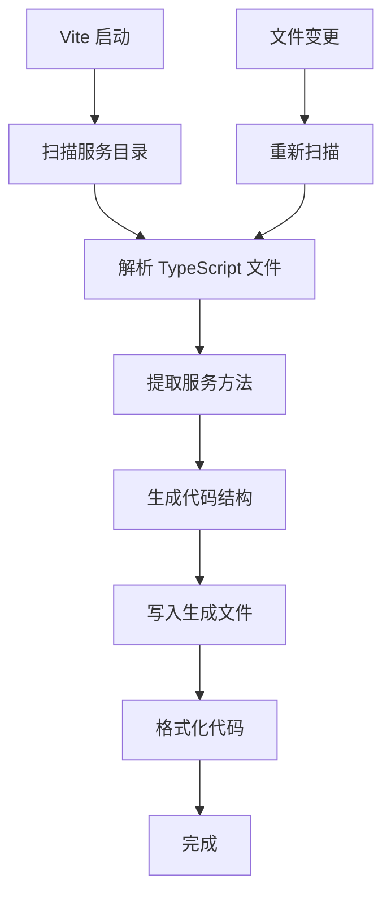

# IPC Service Generator

一个 Vite 插件，用于自动生成 Electron IPC 服务的预加载脚本和主进程注册代码。该插件通过分析 TypeScript 服务类，自动创建类型安全的 IPC 通信接口。

## 功能特性

- 🔍 **自动发现服务方法**：扫描服务目录中的 TypeScript 文件，识别包含 IPC 事件参数的方法
- 🎯 **类型安全**：生成带有完整类型定义的预加载服务接口
- ⚡ **热更新支持**：服务文件变更时自动重新生成代码
- 🎨 **代码格式化**：支持自定义格式化命令自动格式化生成的代码
- 🏷️ **通道前缀**：支持为所有 IPC 通道添加统一前缀
- 🔧 **灵活配置**：支持自定义服务目录、输出目录等配置

## 安装和配置

### 在 Vite 配置中使用

```typescript
// vite.config.ts
import { defineConfig } from "vite";
import ipcServiceGenerator from "./vite-plugins/ipc-service-generator";

export default defineConfig({
  plugins: [
    ipcServiceGenerator({
      servicesDir: "electron/services",    // 服务文件目录
      outputDir: "electron/generated",     // 生成文件输出目录
      channelPrefix: "app:",              // IPC 通道名称前缀
      formatCommand: "pnpm prettier --write", // 代码格式化命令
    }),
  ],
});
```

### 配置选项

| 选项 | 类型 | 默认值 | 描述 |
|------|------|--------|------|
| `servicesDir` | `string` | `"electron/services"` | 服务文件所在目录 |
| `outputDir` | `string` | `"generated"` | 生成文件的输出目录 |
| `channelPrefix` | `string` | `""` | IPC 通道名称前缀 |
| `methodFilter` | `(methodName: string) => boolean` | `undefined` | 方法过滤器函数 |
| `formatCommand` | `string \| false` | `false` | 格式化命令，`false` 表示禁用格式化 |

## 工作原理

### 示例：完整的AST解析和代码生成流程

让我们通过一个具体的例子来深入理解插件的工作原理：

#### 原始服务类

```typescript
// electron/services/user-service/index.ts
import { IpcMainInvokeEvent } from 'electron';

export interface UserInfo {
  id: number;
  name: string;
  email: string;
}

export class UserService {
  private users: UserInfo[] = [
    { id: 1, name: 'Alice', email: 'alice@example.com' }
  ];

  /**
   * 获取用户信息 - 带IPC事件参数的方法
   */
  async getUserById(
    _event: IpcMainInvokeEvent,
    userId: number
  ): Promise<UserInfo | null> {
    return this.users.find(user => user.id === userId) || null;
  }

  /**
   * 普通方法 - 不包含IPC事件参数，不会被插件处理
   */
  private validateEmail(email: string): boolean {
    return email.includes('@');
  }
}
```

#### AST解析过程详解

**1. TypeScript编译器解析阶段**

当插件扫描到这个文件时，TypeScript Compiler API会将源码解析成AST树结构：

```
SourceFile
└── ClassDeclaration (UserService)
    └── MethodDeclaration (getUserById)
        ├── Identifier (name: "getUserById")
        ├── Parameters
        │   ├── Parameter (_event)
        │   │   ├── Identifier (name: "_event")
        │   │   └── TypeReference (IpcMainInvokeEvent)
        │   └── Parameter (userId)
        │       ├── Identifier (name: "userId")
        │       └── TypeReference (number)
        └── TypeReference (returnType: Promise<UserInfo | null>)
```

**2. 插件的AST遍历逻辑**

```typescript
// parser.ts 中的核心逻辑
ts.forEachChild(sourceFile, (node) => {
  if (ts.isClassDeclaration(node) && node.name) {
    const className = node.name.text; // "UserService"
    const serviceName = this.getServiceName(className); // "userService"

    node.members.forEach((member) => {
      if (ts.isMethodDeclaration(member) && member.name) {
        const methodName = member.name.text; // "getUserById"
        const parameters = this.parseMethodParameters(member);
        const hasEventParam = parameters.some(p => p.isEventParam);

        if (hasEventParam) {
          // 这个方法会被处理
        }
      }
    });
  }
});
```

**3. 事件参数识别算法**

```typescript
private isEventParameter(param: ts.ParameterDeclaration): boolean {
  // 1. 名称检查：包含"_event"或等于"event"
  const paramName = param.name.getText(); // "_event"
  if (paramName.includes("_event") || paramName === "event") {
    return true; // ✅ 匹配
  }

  // 2. 类型检查：是否为IpcMainInvokeEvent类型
  if (param.type) {
    const typeText = this.getTypeText(param.type); // "IpcMainInvokeEvent"
    return typeText.includes("IpcMainInvokeEvent"); // ✅ 匹配
  }

  return false;
}
```

**4. 参数解析结果**

对 `getUserById` 方法的参数分析产生：

```typescript
parameters: [
  {
    name: "_event",
    type: "IpcMainInvokeEvent",
    isEventParam: true  // 🔥 被标记为事件参数
  },
  {
    name: "userId",
    type: "number",
    isEventParam: false // 业务参数
  }
]
```

**5. 数据结构构建**

解析完成后，插件构建 `ServiceMethod` 对象：

```typescript
{
  serviceName: "userService",      // UserService → userService
  className: "UserService",
  methodName: "getUserById",
  parameters: [
    {name: "_event", type: "IpcMainInvokeEvent", isEventParam: true},
    {name: "userId", type: "number", isEventParam: false}
  ],
  returnType: "Promise<UserInfo | null>",
  filePath: "electron/services/user-service/index.ts"
}
```

#### 代码生成阶段

**1. 通道名生成**

```typescript
// generator.ts
private generateChannelName(serviceName: string, methodName: string): string {
  const prefix = this.options.channelPrefix || ""; // "app:"
  return `${prefix}${serviceName}:${methodName}`;   // "app:userService:getUserById"
}
```

**2. 预加载服务接口生成**

```typescript
// 过滤掉事件参数，只保留业务参数
const businessParameters = method.parameters
  .filter(p => !p.isEventParam)  // 只保留 userId
  .map(p => ({ name: p.name, type: p.type }));

// 生成接口定义
userService: {
  getUserById(userId: number): Promise<UserInfo | null>;
}

// 生成实现
userService: {
  getUserById: (userId: number) =>
    ipcRenderer.invoke('app:userService:getUserById', userId),
}
```

**3. 主进程注册代码生成**

```typescript
// 实例化服务
const userServiceInstance = new UserService();

// 注册处理器（自动注入事件对象）
ipcMain.handle('app:userService:getUserById', (event, userId) =>
  userServiceInstance.getUserById(event, userId)  // 事件参数被重新注入
);
```

#### 关键逻辑解析

**A. 双向参数映射**

- **前端调用**：`userService.getUserById(123)` → 只传递业务参数
- **IPC传输**：`ipcRenderer.invoke('app:userService:getUserById', 123)`
- **后端接收**：`(event, userId) => service.getUserById(event, userId)` → 事件参数自动注入

**B. 类型安全保证**

```typescript
// 生成的接口保持原方法的类型签名（除了事件参数）
// 原方法：getUserById(_event: IpcMainInvokeEvent, userId: number): Promise<UserInfo | null>
// 生成接口：getUserById(userId: number): Promise<UserInfo | null>
```

**C. 参数过滤机制**

```typescript
// 在生成预加载接口时，插件过滤掉事件参数
const businessParams = method.parameters.filter(p => !p.isEventParam);
// [_event, userId] → [userId]
```

### 1. 服务发现

插件会扫描指定的服务目录，查找所有 TypeScript 文件中的类定义。它会识别包含 IPC 事件参数的方法，这些参数通常命名为：

- `_event`（下划线开头的事件参数）
- `event`（直接命名为 event）
- 类型为 `IpcMainInvokeEvent` 的参数

### 2. 服务命名规则

- **类名转服务名**：`UserService` → `userService`（移除 `Service` 后缀并转为驼峰）
- **通道名生成**：`${channelPrefix}${serviceName}:${methodName}`

### 3. 生成的文件

插件会生成两个主要文件：

#### `preload-services.ts` - 预加载服务接口

```typescript
import { ipcRenderer } from 'electron';

/**
 * Auto-generated IPC service interfaces
 */
export interface AutoGeneratedIpcServices {
  window: {
    maximize(): Promise<void>;
    minimize(): Promise<void>;
    close(): Promise<void>;
  };
}

/**
 * Auto-generated service implementations
 */
export const autoGeneratedServices: AutoGeneratedIpcServices = {
  window: {
    maximize: () => ipcRenderer.invoke('app:window:maximize'),
    minimize: () => ipcRenderer.invoke('app:window:minimize'),
    close: () => ipcRenderer.invoke('app:window:close'),
  },
};
```

#### `ipc-registration.ts` - 主进程注册代码

```typescript
import { ipcMain } from 'electron';
import { WindowService } from '../services';

/**
 * Auto-generated IPC main process registration
 */
export function registerIpcHandlers() {
  // window service registration
  const windowInstance = new WindowService();
  ipcMain.handle('app:window:maximize', (event) =>
    windowInstance.maximize(event)
  );
  ipcMain.handle('app:window:minimize', (event) =>
    windowInstance.minimize(event)
  );
  ipcMain.handle('app:window:close', (event) =>
    windowInstance.close(event)
  );
}

/**
 * Clean up IPC handlers
 */
export function removeIpcHandlers() {
  ipcMain.removeHandler('app:window:maximize');
  ipcMain.removeHandler('app:window:minimize');
  ipcMain.removeHandler('app:window:close');
}
```

## 服务类编写规范

### 基本示例

```typescript
// electron/services/window-service/index.ts
export class WindowService {
  async maximize(_event: Electron.IpcMainInvokeEvent): Promise<void> {
    // 窗口最大化逻辑
  }

  async minimize(_event: Electron.IpcMainInvokeEvent): Promise<void> {
    // 窗口最小化逻辑
  }

  async getWindowState(_event: Electron.IpcMainInvokeEvent): Promise<{
    isMaximized: boolean;
    isMinimized: boolean;
  }> {
    // 返回窗口状态
    return {
      isMaximized: true,
      isMinimized: false,
    };
  }
}
```

### 带参数的服务方法

```typescript
// electron/services/file-service/index.ts
export class FileService {
  async readFile(
    _event: Electron.IpcMainInvokeEvent,
    filePath: string
  ): Promise<string> {
    // 读取文件逻辑
    return "file content";
  }

  async writeFile(
    _event: Electron.IpcMainInvokeEvent,
    filePath: string,
    content: string
  ): Promise<void> {
    // 写入文件逻辑
  }
}
```

### 服务导出

```typescript
// electron/services/index.ts
export { WindowService } from './window-service';
export { FileService } from './file-service';
```

## 架构设计

### 核心组件

```
ipc-service-generator/
├── index.ts          # 插件入口和配置
├── types.ts          # 类型定义
├── parser.ts         # TypeScript AST 解析器
└── generator.ts      # 代码生成器
```

#### TypeScriptServiceParser

负责解析 TypeScript 文件并提取服务方法信息：

- 使用 TypeScript Compiler API 分析源码
- 识别类声明和方法定义
- 提取参数类型和返回类型信息
- 过滤包含 IPC 事件参数的方法

#### IpcStructureGenerator

负责生成 IPC 相关代码：

- 生成预加载服务接口和实现
- 生成主进程 IPC 处理器注册代码
- 处理参数映射和类型转换
- 应用通道前缀和命名规则

### 工作流程



## 使用场景

### 1. 窗口操作服务

```typescript
export class WindowService {
  async maximize(_event: Electron.IpcMainInvokeEvent): Promise<void> {
    const window = BrowserWindow.getFocusedWindow();
    if (window) window.maximize();
  }
}
```

### 2. 文件系统服务

```typescript
export class FileSystemService {
  async showOpenDialog(
    _event: Electron.IpcMainInvokeEvent,
    options: OpenDialogOptions
  ): Promise<OpenDialogReturnValue> {
    return dialog.showOpenDialog(options);
  }
}
```

### 3. 应用配置服务

```typescript
export class ConfigService {
  async getConfig(_event: Electron.IpcMainInvokeEvent): Promise<AppConfig> {
    return this.loadConfig();
  }

  async setConfig(
    _event: Electron.IpcMainInvokeEvent,
    config: Partial<AppConfig>
  ): Promise<void> {
    this.saveConfig(config);
  }
}
```

## 最佳实践

### 1. 服务类组织

- 按功能域拆分服务类（窗口、文件、网络等）
- 每个服务类放在独立的目录中
- 使用清晰的命名约定

### 2. 方法设计

- 所有 IPC 方法都应该是异步的
- 第一个参数必须是 IPC 事件对象
- 使用明确的类型定义
- 避免过于复杂的参数结构

### 3. 错误处理

```typescript
export class FileService {
  async readFile(
    _event: Electron.IpcMainInvokeEvent,
    filePath: string
  ): Promise<string> {
    try {
      return await fs.readFile(filePath, 'utf-8');
    } catch (error) {
      throw new Error(`Failed to read file: ${error.message}`);
    }
  }
}
```

### 4. 类型安全

- 定义清晰的接口和类型
- 使用泛型提高代码复用性
- 避免使用 `any` 类型

## 故障排除

### 常见问题

#### 1. 方法未被识别

**问题**：服务方法没有被插件识别并生成代码

**解决方案**：
- 确认方法包含 IPC 事件参数（`_event`、`event` 或 `IpcMainInvokeEvent` 类型）
- 检查类命名是否符合规范（以 `Service` 结尾）
- 确认文件位于配置的服务目录中

#### 2. 生成的代码格式不正确

**问题**：生成的代码缩进或格式不符合项目规范

**解决方案**：
- 配置正确的 `formatCommand` 选项
- 确保格式化工具已安装并可用
- 检查格式化命令的路径和参数

#### 3. 类型错误

**问题**：生成的代码存在 TypeScript 类型错误

**解决方案**：
- 确认服务方法的参数和返回类型定义正确
- 检查导入的类型是否可用
- 更新 TypeScript 配置以支持生成的代码

### 调试技巧

1. **启用详细日志**：插件会在控制台输出详细的扫描和生成信息
2. **检查生成文件**：直接查看生成的文件内容，确认是否符合预期
3. **使用 TypeScript Compiler API**：可以单独测试 AST 解析逻辑

## 进阶配置

### 自定义方法过滤器

```typescript
ipcServiceGenerator({
  servicesDir: "electron/services",
  outputDir: "electron/generated",
  methodFilter: (methodName: string) => {
    // 只包含以 'handle' 开头的方法
    return methodName.startsWith('handle');
  },
});
```

### 多环境配置

```typescript
const isDev = process.env.NODE_ENV === 'development';

ipcServiceGenerator({
  servicesDir: "electron/services",
  outputDir: "electron/generated",
  channelPrefix: isDev ? "dev:" : "app:",
  formatCommand: isDev ? "pnpm prettier --write" : false,
});
```

## 贡献指南

### 开发环境设置

1. 克隆项目
2. 安装依赖：`pnpm install`
3. 构建插件：`pnpm build`
4. 运行测试：`pnpm test`

### 代码结构

```
vite-plugins/ipc-service-generator/
├── index.ts          # 插件主入口
├── types.ts          # 类型定义
├── parser.ts         # AST 解析器
├── generator.ts      # 代码生成器
└── README.md         # 文档
```

### 提交规范

- 遵循 Conventional Commits 规范
- 添加适当的测试用例
- 更新相关文档

## 许可证

MIT License
